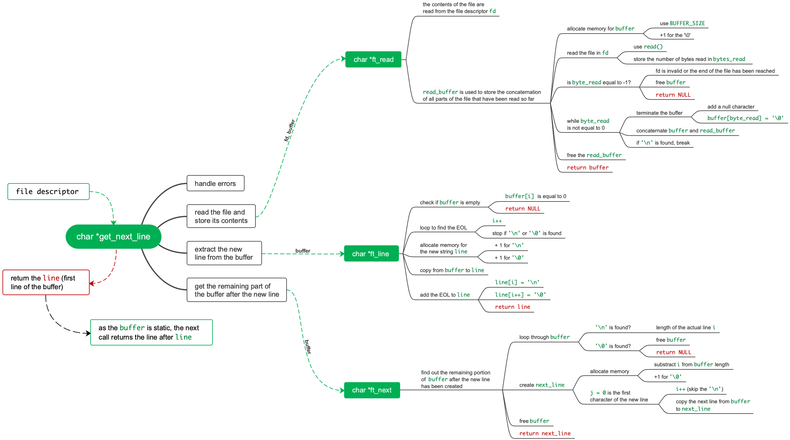

# get_next_line
*Reading a line from a fd is way too tedious*

This project is about programming a function that returns a line read from a file descriptor. Repeated calls (e.g., using a loop) to the <code>get_next_line()</code> function should let you read the text file pointed to by the file descriptor, one line at a time.

  

### What is the approach?
1. handle input errors
2. read “buffer size” number of characters and store it into a static buffer
3. return a pointer to the new line of text
4. return a pointer to the start of the next line in buffer
5. return a pointer to the line of text read from the file

### How does it work?

  

